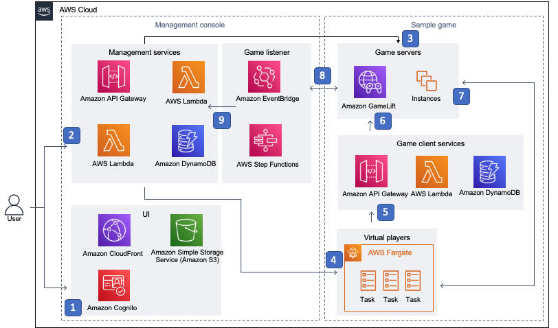

# AWS services

Deploying this solution with the default parameters creates various infrastructure and resources on AWS, which are shown below on the left-hand side as the Testing Toolkit. 

However, the toolkit also requires a game to test, as shown below on the right-hand side as the Test Game. If you chose to deploy the test game when deploying the toolkit then the toolkit's SampleGame will also be installed, otherwise you'll need to deploy your own game integrated with GameLift.

 **Figure 1: Amazon GameLift Testing Toolkit architecture on AWS**

Once the toolkit has been deployed with a game, the key interactions with the toolkit and the game are as follows: 

1. The UI provides the toolkit&#39;s management interface, which is hosted as a static website on [Amazon Simple Storage Service](https://aws.amazon.com/s3/) (Amazon S3) and distributed by [Amazon CloudFront](https://aws.amazon.com/cloudfront/). Users are authenticated via [Amazon Cognito](https://aws.amazon.com/cognito/).
2. The management services provide dynamic features for the web console, which are accessed through [Amazon API Gateway](https://aws.amazon.com/api-gateway/) endpoints that call [AWS Lambda](https://aws.amazon.com/lambda/), and use [Amazon DynamoDB](https://aws.amazon.com/dynamodb/) for storage. API calls are authenticated using Amazon Cognito.
3. Game servers and configuration in [Amazon GameLift](https://aws.amazon.com/gamelift/) are queried and updated by the management services.
4. Virtual players are controlled by the management services and run test game clients as [AWS Fargate](https://aws.amazon.com/fargate/) tasks in [Amazon Elastic Container Service](https://aws.amazon.com/ecs/) (Amazon ECS).
5. Test game clients make calls to game client service API Gateway endpoints, which use Lambda functions to request matchmaking.
6. Matchmaking requests are sent to GameLift to match virtual players in game server sessions.
7. Test game clients connect directly to game servers to play games.
8. GameLift listener listens for GameLift notifications and sends updates using [Amazon EventBridge](https://aws.amazon.com/eventbridge/), and is controlled by [AWS Step Functions](https://aws.amazon.com/step-functions/).
9. GameLift listener forwards notifications to the management services by updating DynamoDB.